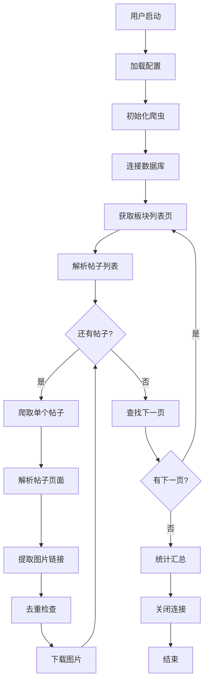
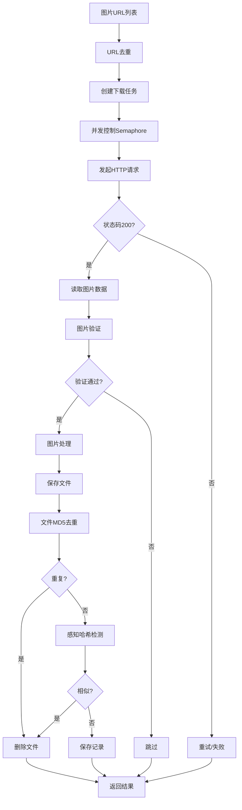

# 系统架构设计文档

**项目名称**: BBS图片爬虫系统  
**版本**: v2.1  
**架构师**: Chang  
**最后更新**: 2026-02-04  
**状态**: 🟢 已发布

---

## 📋 文档说明

### 文档目的
本文档描述BBS图片爬虫系统的整体架构设计，包括系统结构、模块划分、接口定义、数据流程等。

### 适用范围
- 架构师：系统设计
- 开发人员：编码实现
- 测试人员：测试规划
- 运维人员：部署运维

### 版本历史

| 版本 | 日期 | 作者 | 变更内容 |
|------|------|------|----------|
| v1.0 | 2026-02-03 | Chang | 初始版本，完整架构设计 |
| v2.0 | 2026-02-03 | Chang | 统一爬虫架构，预设配置系统 |
| v2.1 | 2026-02-04 | Chang | CLI重构：子命令模式（重大升级） |

---

## 🎯 系统概述

### 1.1 项目背景

BBS论坛图片爬虫系统旨在提供一个通用、高效、可扩展的论坛图片采集解决方案，支持多种论坛系统（Discuz、phpBB等），具备智能去重、自动化配置等特性。

### 1.2 核心目标

- **高效性**: 异步并发，支持每分钟150+图片下载
- **通用性**: 支持多种论坛系统，可自动检测配置
- **可靠性**: 完善的错误处理和重试机制
- **可扩展性**: 模块化设计，易于添加新功能
- **易用性**: 提供CLI工具和详细文档

### 1.3 技术栈

```yaml
语言: Python 3.12+
核心框架:
  - asyncio: 异步IO框架
  - aiohttp: 异步HTTP客户端
  - BeautifulSoup4: HTML解析
  
图片处理:
  - Pillow: 图片处理
  - imagehash: 感知哈希算法
  
数据存储:
  - MongoDB: 元数据存储（可选）
  - Redis: 任务队列和缓存（可选）
  - FileSystem: 图片文件存储
  
工具库:
  - pydantic: 配置管理和数据验证
  - loguru: 结构化日志
  - tenacity: 重试机制
```

---

## 🏗️ 系统架构

### 2.1 整体架构

```
┌─────────────────────────────────────────────────────────────┐
│                        应用层 (Application)                  │
│  ┌──────────────┐  ┌──────────────┐  ┌──────────────┐      │
│  │  CLI工具      │  │  配置管理    │  │  自动化脚本  │      │
│  │ spider.py    │  │ config.py    │  │run_spider.sh │      │
│  │ (子命令模式)  │  │ configs/*.json│ │              │      │
│  └──────────────┘  └──────────────┘  └──────────────┘      │
└─────────────────────────────────────────────────────────────┘
                              ↓
┌─────────────────────────────────────────────────────────────┐
│                        业务层 (Business)                     │
│  ┌──────────────┐  ┌──────────────┐  ┌──────────────┐      │
│  │ BBSSpider    │  │ DiscuzSpider │  │SpiderFactory │      │
│  │ (基础爬虫)   │  │ PhpBBSpider  │  │ (工厂模式)   │      │
│  │              │  │VBulletinSpider│ │ (统一创建)   │      │
│  └──────────────┘  └──────────────┘  └──────────────┘      │
└─────────────────────────────────────────────────────────────┘
                              ↓
┌─────────────────────────────────────────────────────────────┐
│                        核心层 (Core)                         │
│  ┌──────────────┐  ┌──────────────┐  ┌──────────────┐      │
│  │  下载器       │  │  解析器      │  │  去重器      │      │
│  │ Downloader   │  │  Parser      │  │ Deduplicator │      │
│  └──────────────┘  └──────────────┘  └──────────────┘      │
│  ┌──────────────┐  ┌──────────────┐  ┌──────────────┐      │
│  │  存储器       │  │  检测器      │  │  工具类      │      │
│  │  Storage     │  │  Detector    │  │  Utils       │      │
│  └──────────────┘  └──────────────┘  └──────────────┘      │
└─────────────────────────────────────────────────────────────┘
                              ↓
┌─────────────────────────────────────────────────────────────┐
│                      基础设施层 (Infrastructure)              │
│  ┌──────────────┐  ┌──────────────┐  ┌──────────────┐      │
│  │  HTTP客户端  │  │  数据库      │  │  文件系统    │      │
│  │  aiohttp     │  │MongoDB/Redis │  │  File I/O    │      │
│  └──────────────┘  └──────────────┘  └──────────────┘      │
└─────────────────────────────────────────────────────────────┘
```

### 2.2 架构原则

#### 分层架构
- **应用层**: 用户交互界面（CLI、配置）
- **业务层**: 业务逻辑（爬虫策略）
- **核心层**: 核心功能（下载、解析、存储）
- **基础设施层**: 底层服务（HTTP、数据库、文件）

#### 设计模式
- **单例模式**: 配置管理（全局唯一配置实例）
- **工厂模式**: 爬虫创建（根据类型创建不同爬虫）
- **策略模式**: 论坛适配（不同论坛使用不同策略）
- **装饰器模式**: 重试机制（@retry装饰器）
- **观察者模式**: 日志系统（事件驱动的日志记录）

#### SOLID原则
- **单一职责**: 每个模块只负责一个功能
- **开闭原则**: 对扩展开放，对修改关闭
- **里氏替换**: 子类可以替换父类
- **接口隔离**: 接口细粒度，不强制依赖不需要的方法
- **依赖倒置**: 依赖抽象而非具体实现

---

## 📦 模块设计

### 3.1 核心模块

#### 3.1.1 下载器模块 (Downloader)

**文件**: `core/downloader.py`

**职责**:
- 异步下载图片
- 并发控制
- 图片验证和处理
- 下载统计

**接口设计**:
```python
class ImageDownloader:
    async def __aenter__(self) -> 'ImageDownloader':
        """异步上下文管理器入口"""
        
    async def __aexit__(self, exc_type, exc_val, exc_tb):
        """异步上下文管理器出口"""
        
    async def download_image(
        self, 
        url: str, 
        save_path: Path,
        metadata: Optional[Dict[str, Any]] = None
    ) -> Dict[str, Any]:
        """
        下载单张图片
        
        Args:
            url: 图片URL
            save_path: 保存路径
            metadata: 元数据
            
        Returns:
            下载结果 {success, url, save_path, file_size, error}
        """
        
    async def download_batch(
        self,
        image_urls: List[str],
        save_dir: Path,
        metadata: Optional[Dict[str, Any]] = None
    ) -> List[Dict[str, Any]]:
        """批量下载图片（带并发控制）"""
```

**核心算法**:
```python
# 并发控制算法
semaphore = asyncio.Semaphore(max_concurrent_requests)

async def download_with_semaphore(task):
    async with semaphore:  # 限制并发数
        return await task

results = await asyncio.gather(*tasks, return_exceptions=True)
```

**性能指标**:
- 并发数: 5（可配置）
- 单图平均耗时: 0.5秒
- 吞吐量: 150+图片/分钟

#### 3.1.2 解析器模块 (Parser)

**文件**: `core/parser.py`

**职责**:
- 解析HTML页面
- 提取帖子列表
- 提取图片链接
- 提取元数据

**接口设计**:
```python
class BBSParser:
    def parse_thread_list(
        self, 
        html: str, 
        base_url: str
    ) -> List[Dict[str, Any]]:
        """
        解析帖子列表
        
        Returns:
            [
                {
                    'thread_id': str,
                    'title': str,
                    'url': str,
                    ...
                }
            ]
        """
        
    def parse_thread_page(
        self, 
        html: str, 
        thread_url: str
    ) -> Dict[str, Any]:
        """
        解析帖子详情页
        
        Returns:
            {
                'thread_id': str,
                'images': List[str],
                'metadata': Dict,
                'content': str,
                ...
            }
        """
        
    def find_next_page(
        self, 
        html: str, 
        current_url: str
    ) -> Optional[str]:
        """查找下一页链接"""
```

**解析策略**:
```python
# CSS选择器优先级
1. 预设模式（Discuz、phpBB等）
2. 自动检测模式
3. 通用模式（img标签）

# 容错机制
try:
    elements = soup.select(primary_selector)
    if not elements:
        elements = soup.select(fallback_selector)
except:
    logger.warning("解析失败，使用默认策略")
```

#### 3.1.3 去重器模块 (Deduplicator)

**文件**: `core/deduplicator.py`

**职责**:
- URL去重
- 文件内容去重（MD5）
- 相似图片检测（感知哈希）

**接口设计**:
```python
class ImageDeduplicator:
    def is_duplicate_url(self, url: str) -> bool:
        """检查URL是否重复"""
        
    def is_duplicate_file(self, file_path: Path) -> bool:
        """检查文件内容是否重复"""
        
    def load_existing_hashes(self, directory: Path):
        """加载已存在的文件哈希（恢复状态）"""
        
    def get_stats(self) -> Dict[str, Any]:
        """获取去重统计"""
```

**去重算法**:
```python
# 三重去重机制
1. URL哈希去重（快速，O(1)）
   → url_hash = md5(url)
   → if url_hash in url_hashes: return True

2. 文件MD5去重（中速，O(n)）
   → file_hash = md5(file_content)
   → if file_hash in file_hashes: return True

3. 感知哈希去重（慢速，O(n)，检测相似）
   → phash = dhash(image)
   → if phash in phashes: return True
```

**性能优化**:
- 使用Set数据结构（O(1)查询）
- 哈希缓存持久化
- 懒加载（仅在启用时计算）

#### 3.1.4 存储器模块 (Storage)

**文件**: `core/storage.py`

**职责**:
- MongoDB元数据存储
- Redis缓存和队列
- 文件系统管理

**接口设计**:
```python
class Storage:
    def connect(self):
        """连接数据库"""
        
    def close(self):
        """关闭连接"""
        
    # MongoDB操作
    def save_thread(self, thread_data: Dict) -> bool:
        """保存帖子数据"""
        
    def save_image_record(self, image_data: Dict) -> bool:
        """保存图片记录"""
        
    def get_statistics(self) -> Dict[str, Any]:
        """获取统计信息"""
        
    # Redis操作
    def is_url_visited(self, url: str) -> bool:
        """检查URL是否已访问"""
        
    def mark_url_visited(self, url: str) -> bool:
        """标记URL已访问"""
```

**数据模型**:
```javascript
// MongoDB - threads集合
{
    "_id": ObjectId,
    "thread_id": "3479145",
    "title": "神仙道怀旧服公测",
    "url": "https://...",
    "board": "神仙道",
    "images": ["url1", "url2", ...],
    "image_count": 3,
    "metadata": {
        "author": "xxx",
        "post_time": "2024-11-26",
        "views": 1000
    },
    "created_at": ISODate,
    "updated_at": ISODate
}

// MongoDB - images集合
{
    "_id": ObjectId,
    "url": "https://...",
    "save_path": "/downloads/...",
    "file_size": 102400,
    "success": true,
    "metadata": {...},
    "created_at": ISODate
}

// Redis - visited_urls (Set)
visited_urls: {
    "url1_hash",
    "url2_hash",
    ...
}
```

#### 3.1.5 选择器检测器 (SelectorDetector)

**文件**: `core/selector_detector.py`

**职责**:
- 自动识别论坛类型
- 智能生成CSS选择器
- 置信度评估

**接口设计**:
```python
class SelectorDetector:
    def detect_forum_type(self, html: str, url: str) -> str:
        """检测论坛类型 (discuz/phpbb/custom)"""
        
    def auto_detect_selectors(
        self, 
        html: str, 
        url: str
    ) -> Dict[str, Any]:
        """
        自动检测所有选择器
        
        Returns:
            {
                'forum_type': str,
                'selectors': {...},
                'confidence': {...},
                'status': 'success'|'uncertain'
            }
        """
```

**检测算法**:
```python
# 多策略检测
1. 特征匹配（Discuz、phpBB等）
2. 关键词模式匹配（thread、topic等）
3. 重复结构分析（5-50次重复的元素）
4. 文本分析（"下一页"、"next"等）

# 置信度计算
confidence = (基础分 × 一致性分 × 数量分) / 3
```

### 3.2 业务模块

#### 3.2.1 基础爬虫 (BBSSpider)

**文件**: `spider.py`

**职责**:
- 通用爬虫逻辑
- 任务调度
- 统计收集

**类图**:
```
BBSSpider (基类)
├── __init__(config, url, preset)
├── init() / close() / __aenter__ / __aexit__
├── fetch_page(url)
├── crawl_board(board_url, board_name, max_pages)
├── crawl_thread(thread_info)
├── crawl_threads_from_list(thread_urls)
├── download_thread_images(thread_data)
├── process_images(images)  # 钩子方法，子类可重写
└── get_statistics()
```

#### 3.2.2 论坛特定爬虫 (DiscuzSpider等)

**文件**: `spider.py`

**职责**:
- 继承BBSSpider
- 实现论坛特定处理逻辑
- 重写钩子方法

**扩展点**:
```python
class DiscuzSpider(BBSSpider):
    async def process_images(self, images):
        """处理Discuz的附件链接"""
        # 添加 &nothumb=yes 参数
        # 转换相对路径
        # 返回处理后的图片列表

class PhpBBSpider(BBSSpider):
    # phpBB特定处理

class VBulletinSpider(BBSSpider):
    # vBulletin特定处理
```

#### 3.2.3 爬虫工厂 (SpiderFactory)

**文件**: `spider.py`

**职责**:
- 统一创建爬虫实例
- 根据论坛类型选择合适的爬虫类
- 支持自定义爬虫注册

**工厂模式**:
```python
class SpiderFactory:
    _registry = {
        'discuz': DiscuzSpider,
        'phpbb': PhpBBSpider,
        'vbulletin': VBulletinSpider,
        'generic': BBSSpider,
    }
    
    @classmethod
    def register(cls, forum_type, spider_class):
        """注册新的爬虫类型"""
        
    @classmethod
    def create(cls, config=None, url=None, preset=None):
        """创建爬虫实例（根据forum_type选择类）"""
```

### 3.3 应用模块

#### 3.3.1 配置管理 (v2.1 统一架构)

**文件**: `config.py`, `configs/*.json`

**设计**:
```python
# 使用Pydantic进行类型验证和配置管理
class BBSConfig(BaseModel):
    name: str
    forum_type: str
    base_url: str
    thread_list_selector: str
    # ... 自动类型验证

class Config(BaseModel):
    bbs: BBSConfig
    crawler: CrawlerConfig
    image: ImageConfig
    database: DatabaseConfig
    logging: LoggingConfig
```

**配置来源**:
```python
# 1. 论坛类型预设（通用配置）
ForumPresets.discuz()
ForumPresets.phpbb()
ForumPresets.vbulletin()

# 2. 外部配置文件（特定论坛）
get_example_config("xindong")      # 加载 configs/xindong.json
get_example_config("myforum")      # 加载 configs/myforum.json

# 3. 自动检测
ConfigLoader.auto_detect_config(url)  # 智能检测论坛类型
```

**配置加载流程**:
```
1. 命令行参数（最高优先级）
   --config NAME / --preset TYPE / --auto-detect

2. 外部JSON文件 (configs/*.json)
   自动加载板块、URL、选择器等配置

3. 论坛类型预设 (ForumPresets)
   Discuz/phpBB/vBulletin通用配置

4. 自动检测 (ConfigLoader)
   智能分析HTML结构，生成配置

5. 默认值（最低优先级）
   config.py中的默认配置
```

---

## 🔄 数据流程

### 4.1 爬取流程



### 4.2 下载流程



---

## 🔌 接口设计

### 5.1 内部接口

#### 爬虫基类接口
```python
class BaseSpider(ABC):
    @abstractmethod
    async def fetch_page(self, url: str) -> Optional[str]:
        """获取页面内容"""
        
    @abstractmethod
    async def crawl_thread(self, thread_info: Dict) -> None:
        """爬取单个帖子"""
        
    @abstractmethod
    def get_statistics(self) -> Dict[str, Any]:
        """获取统计信息"""
```

#### 下载器接口
```python
class Downloader(ABC):
    @abstractmethod
    async def download(self, url: str, path: Path) -> Dict:
        """下载文件"""
```

### 5.2 外部接口

#### CLI接口 (v2.1 子命令模式)

```bash
# 基础用法
spider.py <subcommand> [options]

# 子命令
crawl-url       爬取单个URL
crawl-urls      爬取配置中的URL列表
crawl-board     爬取单个板块
crawl-boards    爬取配置中的所有板块

# 配置选项（互斥组）
--config NAME           使用配置文件 (configs/NAME.json)
--preset TYPE           使用论坛类型预设 (discuz/phpbb/vbulletin)
--auto-detect           自动检测论坛类型

# 其他选项
--max-pages N           板块最大页数（默认：不限制）

# 示例
spider.py crawl-url "https://bbs.com/thread/123" --auto-detect
spider.py crawl-urls --config xindong
spider.py crawl-board "https://bbs.com/forum?fid=21" --config xindong --max-pages 5
spider.py crawl-boards --config xindong

# 环境变量（向后兼容）
CONFIG                论坛配置名
MODE                  处理模式（已废弃，建议使用子命令）
```

#### Python API (v2.1 统一架构)

```python
# 编程接口（推荐使用工厂模式）
from spider import SpiderFactory
from config import get_example_config

# 方式1: 使用配置文件
config = get_example_config("xindong")
async with SpiderFactory.create(config=config) as spider:
    await spider.crawl_thread({
        'url': '...',
        'thread_id': '123'
    })
    stats = spider.get_statistics()

# 方式2: 使用论坛类型预设
async with SpiderFactory.create(preset="discuz") as spider:
    await spider.crawl_board(
        board_url="...",
        board_name="板块名",
        max_pages=None  # 不限制，爬取所有页
    )

# 方式3: 自动检测
async with SpiderFactory.create(url="https://forum.com") as spider:
    await spider.crawl_threads_from_list(urls)
```

---

## 🔐 安全设计

### 6.1 安全策略

#### 输入验证
```python
# URL验证
def validate_url(url: str) -> bool:
    result = urlparse(url)
    if not result.scheme in ['http', 'https']:
        raise ValueError("Invalid URL scheme")
    return True

# 文件名验证（防止路径遍历）
def safe_filename(filename: str) -> str:
    filename = re.sub(r'[^\w\.-]', '_', filename)
    return filename[:255]  # 限制长度
```

#### 错误处理
```python
# 多层错误处理
try:
    # 业务逻辑
except SpecificError as e:
    logger.error(f"Specific error: {e}")
    # 特定处理
except Exception as e:
    logger.exception("Unexpected error")
    # 通用处理
finally:
    # 资源清理
```

#### 资源限制
```python
# 并发限制
max_concurrent_requests = 5

# 超时控制
request_timeout = 30  # 秒

# 重试限制
max_retries = 3

# 文件大小限制
max_file_size = 20 * 1024 * 1024  # 20MB
```

### 6.2 隐私保护

- **不记录敏感信息**: 用户密码等加密存储
- **日志脱敏**: 敏感字段打码
- **Cookie管理**: 加密存储，定期清理

---

## 📊 性能设计

### 7.1 性能指标

| 指标 | 目标值 | 当前值 |
|------|-------|--------|
| 单图下载时间 | < 1秒 | ~0.5秒 |
| 并发下载速度 | > 100图/分 | 150+图/分 |
| 内存占用 | < 500MB | ~200MB |
| CPU占用 | < 50% | ~30% |
| 响应时间 | < 2秒 | ~1秒 |

### 7.2 性能优化

#### 异步IO优化
```python
# 使用asyncio提升并发性能
async def download_batch(urls):
    tasks = [download(url) for url in urls]
    results = await asyncio.gather(*tasks)
    # 性能提升: 15x vs 同步方式
```

#### 连接池复用
```python
# 复用HTTP连接
session = aiohttp.ClientSession()
# 避免频繁创建/销毁连接
```

#### 缓存策略
```python
# Redis缓存已访问URL
if redis.sismember('visited', url):
    return  # 跳过
```

#### 批量操作
```python
# 批量插入数据库
collection.insert_many(documents)  # vs insert_one
```

---

## 🧪 测试设计

### 8.1 测试策略

#### 单元测试
```python
# 测试核心功能
def test_url_deduplication():
    dedup = ImageDeduplicator()
    assert dedup.is_duplicate_url("url1") == False
    assert dedup.is_duplicate_url("url1") == True
```

#### 集成测试
```python
# 测试模块协作
async def test_download_workflow():
    async with BBSSpider() as spider:
        result = await spider.crawl_thread(test_thread)
        assert result['images_downloaded'] > 0
```

#### 性能测试
```bash
# 压力测试
python -m pytest tests/performance/ --benchmark
```

### 8.2 测试覆盖

| 模块 | 单元测试 | 集成测试 | 覆盖率目标 |
|------|---------|---------|-----------|
| downloader | ✅ | ✅ | 80% |
| parser | ✅ | ✅ | 85% |
| deduplicator | ✅ | ✅ | 90% |
| storage | ✅ | ✅ | 70% |

---

## 🚀 部署设计

### 9.1 部署架构

```
生产环境:
├── 应用服务器 (Spider App)
├── MongoDB 服务器
├── Redis 服务器
└── 文件存储 (NFS/OSS)

开发环境:
└── 本地虚拟环境 (venv)
```

### 9.2 部署流程

```bash
# 1. 环境准备
sudo apt install python3.12-venv
python3 -m venv venv

# 2. 依赖安装
source venv/bin/activate
pip install -r requirements.txt

# 3. 配置部署
cp .env.example .env
vim .env

# 4. 数据库初始化
python scripts/init_db.py

# 5. 启动服务
./run_spider.sh
```

---

## 📈 监控设计

### 10.1 监控指标

```python
# 应用指标
- 爬取速度 (图片/分钟)
- 成功率 (%)
- 错误率 (%)
- 队列长度

# 系统指标
- CPU使用率
- 内存使用率
- 磁盘IO
- 网络带宽
```

### 10.2 日志设计

```python
# 日志级别
DEBUG: 调试信息
INFO:  正常流程
WARNING: 警告信息
ERROR: 错误信息

# 日志格式
[时间] | [级别] | [模块] | 消息内容

# 日志轮转
rotation="100 MB"
retention="30 days"
```

---

## 🔄 扩展设计

### 11.1 扩展点

#### 添加新论坛支持
```python
class NewForumSpider(BBSSpider):
    """1. 继承基类"""
    
    async def custom_parse(self, html):
        """2. 重写特定方法"""
        
    # 3. 配置选择器
    config = Config(
        bbs={'selectors': {...}}
    )
```

#### 添加新功能模块
```python
# 1. 在core/目录创建新模块
core/new_feature.py

# 2. 定义接口
class NewFeature:
    def process(self, data): ...

# 3. 集成到主流程
spider.new_feature = NewFeature()
```

### 11.2 可扩展性

- **水平扩展**: 支持分布式部署
- **垂直扩展**: 支持增加并发数
- **功能扩展**: 插件化架构
- **存储扩展**: 支持多种存储后端

---

## 📋 附录

### A. 技术决策记录 (ADR)

#### ADR-001: 选择异步IO框架
- **状态**: 已采用
- **决策**: 使用asyncio + aiohttp
- **理由**: 高并发性能，Python原生支持
- **后果**: 需要async/await编程，学习曲线

#### ADR-002: 选择MongoDB存储
- **状态**: 已采用
- **决策**: 使用MongoDB存储元数据
- **理由**: 灵活的JSON格式，适合非结构化数据
- **后果**: 需要安装额外服务，可选方案

### B. 术语表

| 术语 | 英文 | 说明 |
|------|------|------|
| 爬虫 | Spider/Crawler | 自动化网页数据采集程序 |
| 去重 | Deduplication | 删除重复数据 |
| 感知哈希 | Perceptual Hash | 检测相似图片的算法 |
| 协程 | Coroutine | 异步编程的基本单元 |
| 选择器 | Selector | CSS/XPath选择器 |

### C. 参考资料

- [Python asyncio文档](https://docs.python.org/3/library/asyncio.html)
- [aiohttp文档](https://docs.aiohttp.org/)
- [BeautifulSoup文档](https://www.crummy.com/software/BeautifulSoup/bs4/doc/)
- [Discuz开发文档](http://www.discuz.net/wiki/)

---

## ✅ 审批记录

| 角色 | 姓名 | 审批意见 | 日期 |
|------|------|---------|------|
| 架构师 | Chang | 批准 | 2026-02-03 |
| 技术负责人 | - | 待审批 | - |
| 项目经理 | - | 待审批 | - |

---

**文档状态**: 🟢 已发布  
**下次评审**: 每季度或重大变更时  
**维护者**: 架构师团队
