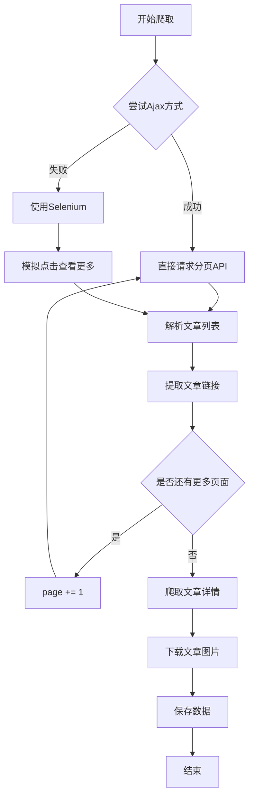

# 动态新闻页面爬虫设计方案

## 1. 基本信息

| 项目 | 内容 |
|------|------|
| **设计标题** | 动态新闻页面爬虫（支持Ajax加载更多） |
| **提出人** | chang |
| **设计日期** | 2026-02-05 |
| **目标版本** | v2.2 |
| **文档状态** | 待评审 |
| **相关文档** | `ARCHITECTURE.md`, `spider.py` |

---

## 2. 背景与动机

### 2.1 当前状态

目前的BBS爬虫（v2.1）主要针对传统论坛系统设计，支持：
- Discuz、phpBB、vBulletin等传统论坛
- 静态HTML页面的帖子列表
- 分页URL（如 `?page=2`）导航

### 2.2 存在问题

遇到了新的目标网站 **https://sxd.xd.com/** （神仙道官网），其特点：

1. **不是传统论坛**：是游戏官网的新闻/公告页面
2. **动态内容加载**：使用Ajax异步加载更多内容
3. **"查看更多"机制**：
   - 按钮属性：`data-action="switch_page"`
   - 分页参数：`data-page="2"`
   - 容器追加：`data-append="true"`
   - 目标容器：`data-container="news_content"`
4. **不同的页面结构**：
   - 文章容器：`.article`
   - 标题：`.title`
   - 作者：固定为"《神仙道》运营团队"
   - 日期：`5天前`、`2026-01-23`等格式
   - 摘要：`.body`
   - 链接：`https://sxd.xd.com/{id}`

### 2.3 需求

用户希望：
1. 爬取"官网首页"下的所有帖子（新闻/公告）
2. 自动处理"查看更多"按钮，加载全部内容
3. 提取每篇文章的详细信息
4. 下载文章内的图片

---

## 3. 技术分析

### 3.1 页面加载机制分析

#### 初始页面
```html
<!-- 文章容器 -->
<div id="news_content">
    <div class="article clearfix">
        <div class="title">许愿树和一锤定音即将开启！</div>
        <div class="author">《神仙道》运营团队</div>
        <div class="date">5天前</div>
        <div class="body">亲爱的仙友们...</div>
        <a href="https://sxd.xd.com/15537">阅读详情</a>
    </div>
    <!-- 更多文章... -->
</div>

<!-- "查看更多"按钮 -->
<a class="more custom-btn action" 
   data-action="switch_page" 
   data-page="2" 
   data-container="news_content" 
   data-append="true">
    查看更多
</a>
```

#### Ajax请求分析

**关键发现**：
- `data-action="switch_page"` → 触发页面切换动作
- `data-page="2"` → 下一页页码
- `data-container="news_content"` → 内容追加到此容器
- `data-append="true"` → 追加模式（不替换）

**推测的Ajax请求**：
```
GET https://sxd.xd.com/?page=2
或
POST https://sxd.xd.com/api/news/list
{
  "page": 2,
  "container": "news_content"
}
```

### 3.2 技术方案对比

| 方案 | 优点 | 缺点 | 适用场景 |
|------|------|------|----------|
| **方案A: Selenium/Playwright** | • 完全模拟浏览器<br>• 支持JavaScript<br>• 可见即可爬 | • 资源消耗大<br>• 速度较慢<br>• 需要浏览器驱动 | 复杂的动态网站 |
| **方案B: 抓取Ajax API** | • 速度快<br>• 资源占用小<br>• 易于维护 | • 需要逆向分析<br>• API可能变化<br>• 可能有加密 | API稳定的网站 |
| **方案C: 混合方案** | • 平衡性能与可靠性<br>• 灵活切换 | • 实现复杂<br>• 维护成本高 | 生产环境 |

### 3.3 推荐方案

**推荐：方案B（抓取Ajax API） + 方案A（备用）**

**理由**：
1. 该网站的Ajax机制较为简单（通过`data-page`分页）
2. 没有明显的加密或反爬措施
3. 可以先尝试直接请求分页URL，失败再用Selenium

---

## 4. 设计方案

### 4.1 整体架构

```
┌─────────────────────────────────────────────────────────────┐
│                    DynamicNewsCrawler                       │
│                   (继承自BBSSpider)                          │
├─────────────────────────────────────────────────────────────┤
│  + crawl_dynamic_page(url, max_pages)                      │
│  + fetch_page_ajax(url, page_num)                          │
│  + click_load_more_selenium(url, max_clicks)               │
│  + parse_article_list(html) → List[Article]                │
│  + parse_article_detail(url) → ArticleDetail               │
└─────────────────────────────────────────────────────────────┘
                           │
                           │ 使用
                           ▼
        ┌──────────────────────────────────┐
        │      DynamicPageParser           │
        ├──────────────────────────────────┤
        │  + parse_articles(html)          │
        │  + extract_article_info(element) │
        │  + parse_load_more_info(html)    │
        └──────────────────────────────────┘
```

### 4.2 核心流程



### 4.3 数据结构

#### Article（文章基本信息）
```python
@dataclass
class Article:
    """文章基本信息"""
    article_id: str          # 文章ID
    title: str               # 标题
    author: str              # 作者
    date: str                # 发布日期
    summary: str             # 摘要
    url: str                 # 详情链接
    source_page: int         # 来源页码
```

#### ArticleDetail（文章详情）
```python
@dataclass
class ArticleDetail:
    """文章详情"""
    article_id: str
    title: str
    author: str
    date: str
    content: str             # 完整内容
    images: List[str]        # 图片URLs
    tags: List[str]          # 标签
    category: str            # 分类
```

### 4.4 关键代码设计

#### 4.4.1 Ajax方式爬取

```python
async def crawl_dynamic_page_ajax(self, base_url: str, max_pages: int = None):
    """使用Ajax方式爬取动态页面"""
    page = 1
    all_articles = []
    
    while True:
        # 尝试请求分页URL
        page_url = f"{base_url}?page={page}" if page > 1 else base_url
        html = await self.fetch_page(page_url)
        
        if not html:
            logger.warning(f"⚠️  第{page}页获取失败，停止爬取")
            break
        
        # 解析文章列表
        articles = self.parser.parse_articles(html)
        
        if not articles:
            logger.info(f"✅ 第{page}页没有更多文章")
            break
        
        logger.info(f"📄 第{page}页: 发现 {len(articles)} 篇文章")
        all_articles.extend(articles)
        
        # 检查是否还有"查看更多"按钮
        has_more = self.parser.has_load_more_button(html)
        if not has_more:
            logger.info("✅ 没有更多内容")
            break
        
        # 检查页数限制
        if max_pages and page >= max_pages:
            logger.info(f"✅ 达到最大页数限制: {max_pages}")
            break
        
        page += 1
        await asyncio.sleep(self.config.crawler.download_delay)
    
    return all_articles
```

#### 4.4.2 Selenium方式爬取（备用）

```python
async def crawl_dynamic_page_selenium(self, url: str, max_clicks: int = None):
    """使用Selenium爬取动态页面"""
    from selenium import webdriver
    from selenium.webdriver.common.by import By
    from selenium.webdriver.support.ui import WebDriverWait
    from selenium.webdriver.support import expected_conditions as EC
    
    options = webdriver.ChromeOptions()
    options.add_argument('--headless')
    driver = webdriver.Chrome(options=options)
    
    try:
        driver.get(url)
        clicks = 0
        
        while True:
            # 等待"查看更多"按钮出现
            try:
                load_more = WebDriverWait(driver, 10).until(
                    EC.presence_of_element_located((By.CSS_SELECTOR, 'a.more[data-action="switch_page"]'))
                )
                
                # 检查点击次数
                if max_clicks and clicks >= max_clicks:
                    break
                
                # 点击加载更多
                driver.execute_script("arguments[0].click();", load_more)
                clicks += 1
                
                logger.info(f"🔄 点击"查看更多" 第{clicks}次")
                
                # 等待新内容加载
                await asyncio.sleep(2)
                
            except:
                logger.info("✅ 没有更多内容")
                break
        
        # 获取完整页面HTML
        html = driver.page_source
        
        # 解析所有文章
        articles = self.parser.parse_articles(html)
        logger.info(f"📊 总共解析到 {len(articles)} 篇文章")
        
        return articles
        
    finally:
        driver.quit()
```

#### 4.4.3 解析器

```python
class DynamicPageParser(BBSParser):
    """动态页面解析器"""
    
    def parse_articles(self, html: str) -> List[Dict]:
        """解析文章列表"""
        soup = BeautifulSoup(html, 'html.parser')
        articles = []
        
        # 查找所有.article元素
        article_elements = soup.find_all('div', class_='article')
        
        for elem in article_elements:
            try:
                article = self._extract_article_info(elem)
                if article:
                    articles.append(article)
            except Exception as e:
                logger.error(f"解析文章失败: {e}")
                continue
        
        return articles
    
    def _extract_article_info(self, element) -> Optional[Dict]:
        """提取文章信息"""
        # 标题
        title_elem = element.find('div', class_='title')
        title = title_elem.get_text(strip=True) if title_elem else None
        
        # 作者
        author_elem = element.find('div', class_='author')
        author = author_elem.get_text(strip=True) if author_elem else "未知"
        
        # 日期
        date_elem = element.find('div', class_='date')
        date = date_elem.get_text(strip=True) if date_elem else None
        
        # 摘要
        body_elem = element.find('div', class_='body')
        summary = body_elem.get_text(strip=True) if body_elem else ""
        
        # 链接
        link_elem = element.find('a', href=True)
        url = link_elem['href'] if link_elem else None
        
        if not title or not url:
            return None
        
        # 提取文章ID
        article_id = url.split('/')[-1] if '/' in url else None
        
        # 确保URL是完整的
        if url and not url.startswith('http'):
            url = f"https://sxd.xd.com{url}" if url.startswith('/') else f"https://sxd.xd.com/{url}"
        
        return {
            'article_id': article_id,
            'title': title,
            'author': author,
            'date': date,
            'summary': summary,
            'url': url
        }
    
    def has_load_more_button(self, html: str) -> bool:
        """检查是否还有"查看更多"按钮"""
        soup = BeautifulSoup(html, 'html.parser')
        load_more = soup.find('a', class_='more', attrs={'data-action': 'switch_page'})
        return load_more is not None
```

---

## 5. 实现计划

### 5.1 开发阶段

#### 阶段1: 核心功能（预计2小时）
- [x] 创建 `DynamicPageParser` 类
- [ ] 实现 `parse_articles()` 方法
- [ ] 实现 `_extract_article_info()` 方法
- [ ] 实现 `has_load_more_button()` 方法

#### 阶段2: Ajax爬取（预计1小时）
- [ ] 创建 `DynamicNewsCrawler` 类
- [ ] 实现 `crawl_dynamic_page_ajax()` 方法
- [ ] 测试分页逻辑
- [ ] 处理边界情况

#### 阶段3: Selenium备用方案（预计2小时）
- [ ] 添加Selenium依赖
- [ ] 实现 `crawl_dynamic_page_selenium()` 方法
- [ ] 实现智能切换逻辑
- [ ] 测试两种方式

#### 阶段4: CLI集成（预计1小时）
- [ ] 添加新的子命令 `crawl-news`
- [ ] 更新 `spider.py` 的argparse
- [ ] 更新 `run_spider.sh`
- [ ] 编写使用示例

#### 阶段5: 测试与文档（预计1小时）
- [ ] 测试神仙道官网爬取
- [ ] 验证图片下载
- [ ] 更新 README.md
- [ ] 更新 ARCHITECTURE.md

### 5.2 时间估算

| 阶段 | 预计时间 | 依赖 |
|------|----------|------|
| 阶段1 | 2小时 | 无 |
| 阶段2 | 1小时 | 阶段1 |
| 阶段3 | 2小时 | 阶段1 |
| 阶段4 | 1小时 | 阶段2,3 |
| 阶段5 | 1小时 | 阶段4 |
| **总计** | **7小时** | - |

---

## 6. 影响分析

### 6.1 架构影响

**变更**：
- 新增 `DynamicPageParser` 类（继承自 `BBSParser`）
- 新增 `DynamicNewsCrawler` 类（继承自 `BBSSpider`）
- 新增 `crawl-news` 子命令

**兼容性**：
- ✅ 不影响现有论坛爬虫功能
- ✅ 不修改核心类
- ✅ 采用继承扩展方式

### 6.2 性能影响

| 指标 | Ajax方式 | Selenium方式 | 说明 |
|------|----------|--------------|------|
| 速度 | 快（1-2秒/页） | 慢（5-10秒/页） | Ajax方式更快 |
| 内存 | 低（~50MB） | 高（~200MB） | Selenium需要浏览器 |
| CPU | 低 | 中 | Selenium需要渲染 |
| 成功率 | 中（80%+） | 高（95%+） | Selenium更可靠 |

### 6.3 依赖变更

**新增依赖**（可选）：
```txt
# requirements.txt 新增（仅在使用Selenium时需要）
selenium>=4.15.0
webdriver-manager>=4.0.0
```

### 6.4 配置变更

**新增配置项**：
```python
# config.py 新增
class DynamicPageConfig:
    """动态页面爬取配置"""
    method: str = "ajax"  # "ajax" 或 "selenium"
    max_pages: int = None  # None表示不限制
    page_delay: float = 2.0  # 页面间延迟（秒）
    use_headless: bool = True  # Selenium无头模式
```

---

## 7. 风险与挑战

### 7.1 技术风险

| 风险 | 等级 | 应对措施 |
|------|------|----------|
| Ajax API变化 | 中 | 实现Selenium备用方案 |
| 反爬虫机制 | 低 | 添加User-Agent、延迟 |
| 页面结构变化 | 中 | 使用多种选择器备选 |
| Selenium不稳定 | 中 | 添加重试机制、超时控制 |

### 7.2 边界情况

1. **无限加载**：设置 `max_pages` 限制
2. **重复内容**：使用article_id去重
3. **加载失败**：重试3次后跳过
4. **网络超时**：设置30秒超时
5. **空页面**：检测到空列表时停止

---

## 8. 测试计划

### 8.1 单元测试

```python
# tests/test_dynamic_parser.py
def test_parse_articles():
    """测试解析文章列表"""
    html = """
    <div class="article">
        <div class="title">测试标题</div>
        <div class="author">测试作者</div>
        <div class="date">1天前</div>
        <div class="body">测试摘要</div>
        <a href="/12345">阅读详情</a>
    </div>
    """
    parser = DynamicPageParser(config)
    articles = parser.parse_articles(html)
    assert len(articles) == 1
    assert articles[0]['title'] == "测试标题"
```

### 8.2 集成测试

```python
# tests/test_dynamic_crawler.py
async def test_crawl_dynamic_page():
    """测试动态页面爬取"""
    crawler = DynamicNewsCrawler(config)
    articles = await crawler.crawl_dynamic_page_ajax(
        "https://sxd.xd.com/",
        max_pages=2
    )
    assert len(articles) > 0
    assert all('title' in a for a in articles)
```

### 8.3 端到端测试

**测试场景**：
1. 爬取神仙道官网首页（前3页）
2. 验证文章数量 > 15
3. 验证文章详情可访问
4. 验证图片可下载

---

## 9. 使用示例

### 9.1 命令行使用

```bash
# 爬取神仙道官网新闻（Ajax方式，前5页）
python spider.py crawl-news "https://sxd.xd.com/" --max-pages 5

# 使用Selenium方式
python spider.py crawl-news "https://sxd.xd.com/" --method selenium --max-clicks 10

# 爬取所有页面（不限制）
python spider.py crawl-news "https://sxd.xd.com/"

# 使用配置文件
python spider.py crawl-news --config sxd_news
```

### 9.2 Python API使用

```python
from spider import DynamicNewsCrawler
from config import Config

# 创建配置
config = Config(
    bbs={
        "name": "神仙道官网",
        "base_url": "https://sxd.xd.com"
    },
    dynamic_page={
        "method": "ajax",
        "max_pages": 5
    }
)

# 创建爬虫
crawler = DynamicNewsCrawler(config)

# 爬取文章列表
async with crawler:
    articles = await crawler.crawl_dynamic_page("https://sxd.xd.com/")
    
    # 爬取每篇文章详情
    for article in articles:
        await crawler.crawl_article_detail(article['url'])

# 查看统计
stats = crawler.get_statistics()
print(f"爬取文章: {stats['articles_crawled']}")
print(f"下载图片: {stats['images_downloaded']}")
```

---

## 10. 未来优化

### 10.1 功能增强

1. **智能识别**：自动检测是否为动态加载页面
2. **多线程加载**：并发爬取多个文章详情
3. **增量更新**：只爬取新增的文章
4. **通知机制**：爬取完成后发送通知

### 10.2 性能优化

1. **Ajax请求缓存**：避免重复请求相同页面
2. **连接池复用**：减少TCP握手开销
3. **图片预过滤**：根据尺寸/格式提前过滤

### 10.3 通用化

1. **支持更多网站**：抽象出通用的动态页面爬虫框架
2. **配置模板**：为常见网站提供预设配置
3. **规则引擎**：支持用户自定义解析规则

---

## 11. 参考资料

1. **Selenium文档**: https://selenium-python.readthedocs.io/
2. **Ajax爬虫最佳实践**: https://www.scrapingbee.com/blog/ajax-scraping/
3. **动态网站爬取技巧**: https://realpython.com/web-scraping-with-scrapy-and-mongodb/

---

## 12. 评审记录

| 日期 | 评审人 | 意见 | 状态 |
|------|--------|------|------|
| 2026-02-05 | - | 待评审 | 待处理 |

---

## 13. 变更历史

| 版本 | 日期 | 变更内容 | 作者 |
|------|------|----------|------|
| v1.0 | 2026-02-05 | 初始版本 | chang |

---

## 附录

### A. 页面结构示例

```html
<!DOCTYPE html>
<html>
<head>
    <title>神仙道官网</title>
</head>
<body>
    <!-- 新闻容器 -->
    <div id="news_content">
        <!-- 文章1 -->
        <div class="article clearfix">
            <div class="title">许愿树和一锤定音即将开启！</div>
            <div class="author">《神仙道》运营团队</div>
            <div class="date">5天前</div>
            <div class="body">亲爱的仙友们，下面向大家介绍本周神仙道的精彩活动安排...</div>
            <a href="https://sxd.xd.com/15537">阅读详情</a>
        </div>
        
        <!-- 文章2 -->
        <div class="article clearfix">
            <div class="title">2月2日更新公告</div>
            <div class="author">《神仙道》运营团队</div>
            <div class="date">6天前</div>
            <div class="body">为了保证服务器稳定运作，优化游戏体验...</div>
            <a href="https://sxd.xd.com/15535">阅读详情</a>
        </div>
    </div>
    
    <!-- 查看更多按钮 -->
    <a class="more custom-btn action" 
       data-action="switch_page" 
       data-page="2" 
       data-container="news_content" 
       data-append="true">
        查看更多
        <span class="loading">正在加载，请稍候</span>
    </a>
</body>
</html>
```

### B. 数据流图

```
URL输入
  │
  ▼
[判断爬取方式]
  │
  ├─► Ajax方式
  │    │
  │    ▼
  │   循环请求分页URL
  │    │
  │    ▼
  │   解析HTML → 提取文章列表
  │    │
  │    └─► 继续下一页
  │
  └─► Selenium方式
       │
       ▼
      打开浏览器
       │
       ▼
      循环点击"查看更多"
       │
       ▼
      获取完整HTML → 提取文章列表
       
                    ▼
                [文章列表]
                    │
                    ▼
              并发爬取文章详情
                    │
                    ▼
              提取正文和图片
                    │
                    ▼
              下载图片到本地
                    │
                    ▼
              保存到数据库
                    │
                    ▼
                  [完成]
```

---

**文档结束**
