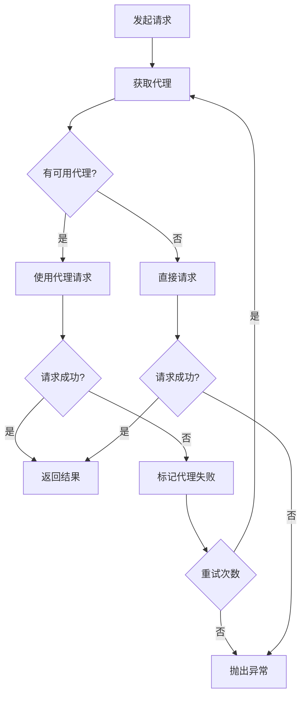

# 设计变更提案模板

> 📝 **使用说明**: 复制此模板，重命名为 `YYYY-MM-DD-功能简述.md`，填写各部分内容

---

## 基本信息

- **标题**: [功能名称，例如：添加代理池功能]
- **提出人**: [姓名]
- **日期**: [YYYY-MM-DD]
- **状态**: [草稿 / 评审中 / 已批准 / 已实施 / 已拒绝]
- **关联Issue**: #[issue编号]
- **优先级**: [🔴 高 / 🟡 中 / 🟢 低]
- **预计工作量**: [X小时/天]

---

## 1. 变更概述

### 1.1 变更目标
简述要做什么变更，达成什么目标。

**示例**:
```
添加代理池功能，支持自动轮换代理IP，提高爬虫的稳定性和隐蔽性。
```

### 1.2 变更原因
为什么需要这个变更？解决什么问题？

**示例**:
```
- 当前爬虫使用固定IP，容易被目标网站封禁
- 高频请求会触发反爬虫机制
- 需要提升爬虫的抗封禁能力
```

### 1.3 预期收益
变更后会带来什么好处？

**示例**:
```
- 降低IP被封概率 90%
- 支持更高并发爬取
- 提升系统可用性至 99.5%
```

---

## 2. 现状分析

### 2.1 当前实现
当前的设计/实现是怎样的？

```python
# 当前代码示例
class Downloader:
    def __init__(self):
        self.session = aiohttp.ClientSession()
    
    async def download(self, url: str):
        # 直接请求，无代理
        async with self.session.get(url) as response:
            return await response.read()
```

### 2.2 存在问题
当前实现存在什么问题或限制？

**示例**:
- ❌ 单一IP容易被封
- ❌ 无法绕过IP限制
- ❌ 高频请求会失败

### 2.3 影响范围
哪些模块会受到影响？

**示例**:
- `core/downloader.py` - 需要修改
- `config.py` - 需要添加代理配置
- `bbs_spider.py` - 需要传递代理参数

---

## 3. 设计方案

### 3.1 架构变更

#### 变更前架构
```
Downloader
    ↓
aiohttp.ClientSession
    ↓
目标网站（单一IP）
```

#### 变更后架构
```
Downloader
    ↓
ProxyPool ← (新增)
    ↓
aiohttp.ClientSession (with proxy)
    ↓
目标网站（多IP）
```

### 3.2 模块设计

#### 新增模块: ProxyPool

**职责**:
- 管理代理IP池
- 轮换代理
- 健康检查
- 失败重试

**类图**:
```
ProxyPool
├── __init__(proxies: List[str])
├── get_proxy() -> Optional[str]
├── mark_proxy_failed(proxy: str)
├── health_check(proxy: str) -> bool
└── get_statistics() -> Dict
```

### 3.3 接口设计

```python
class ProxyPool:
    """
    代理池管理器
    
    维护一个可用代理列表，提供代理轮换和健康检查功能。
    
    Attributes:
        proxies: 代理列表
        failed_proxies: 失败代理集合
        current_index: 当前索引
    
    Examples:
        >>> pool = ProxyPool(['http://proxy1:8080', 'http://proxy2:8080'])
        >>> proxy = pool.get_proxy()
        >>> print(proxy)
        'http://proxy1:8080'
    """
    
    def __init__(self, proxies: List[str]):
        """
        初始化代理池
        
        Args:
            proxies: 代理地址列表，格式为 'http://ip:port'
        """
        pass
    
    def get_proxy(self) -> Optional[str]:
        """
        获取一个可用代理
        
        使用轮询策略从代理池中选择代理。
        
        Returns:
            代理地址，如果没有可用代理则返回None
        """
        pass
    
    def mark_proxy_failed(self, proxy: str) -> None:
        """
        标记代理失败
        
        将失败的代理加入黑名单，一定时间后会重新尝试。
        
        Args:
            proxy: 失败的代理地址
        """
        pass
    
    async def health_check(self, proxy: str) -> bool:
        """
        检查代理健康状态
        
        向测试URL发送请求，验证代理是否可用。
        
        Args:
            proxy: 要检查的代理地址
            
        Returns:
            True表示代理可用，False表示不可用
        """
        pass
```

### 3.4 数据模型

```python
# 代理配置
ProxyConfig = {
    'proxies': [
        'http://proxy1:8080',
        'http://proxy2:8080',
        'socks5://proxy3:1080'
    ],
    'rotation_strategy': 'round_robin',  # 或 'random'
    'health_check_url': 'https://httpbin.org/ip',
    'health_check_interval': 300,  # 秒
    'max_failures': 3
}

# 代理状态
ProxyStatus = {
    'proxy': 'http://proxy1:8080',
    'status': 'active',  # active / failed / checking
    'success_count': 100,
    'failure_count': 2,
    'last_used': '2026-02-03T10:00:00',
    'last_check': '2026-02-03T09:55:00'
}
```

### 3.5 流程设计



---

## 4. 技术方案

### 4.1 核心算法

#### 轮询策略 (Round Robin)
```python
def get_proxy(self) -> Optional[str]:
    if not self.available_proxies:
        return None
    
    proxy = self.available_proxies[self.current_index]
    self.current_index = (self.current_index + 1) % len(self.available_proxies)
    return proxy
```

#### 健康检查
```python
async def health_check(self, proxy: str) -> bool:
    try:
        async with aiohttp.ClientSession() as session:
            async with session.get(
                self.health_check_url,
                proxy=proxy,
                timeout=aiohttp.ClientTimeout(total=10)
            ) as response:
                return response.status == 200
    except Exception:
        return False
```

### 4.2 依赖变更

**新增依赖**:
```txt
# requirements.txt
aiohttp-socks>=0.8.0  # 支持SOCKS代理
```

**无需移除依赖**

### 4.3 配置变更

**新增配置项** (config.py):
```python
class ProxyConfig(BaseModel):
    enabled: bool = Field(default=False, description="是否启用代理")
    proxies: List[str] = Field(default_factory=list, description="代理列表")
    rotation_strategy: str = Field(default="round_robin", description="轮换策略")
    health_check_url: str = Field(default="https://httpbin.org/ip", description="健康检查URL")
    health_check_interval: int = Field(default=300, description="健康检查间隔(秒)")
    max_failures: int = Field(default=3, description="最大失败次数")

class Config(BaseModel):
    # ... 现有配置
    proxy: ProxyConfig = Field(default_factory=ProxyConfig, description="代理配置")
```

**环境变量** (.env):
```bash
# 代理配置
PROXY_ENABLED=true
PROXY_LIST=http://proxy1:8080,http://proxy2:8080
PROXY_ROTATION_STRATEGY=round_robin
```

---

## 5. 影响分析

### 5.1 性能影响

| 指标 | 变更前 | 变更后 | 变化 |
|------|-------|-------|------|
| 单次请求延迟 | 200ms | 250ms | +25% |
| 并发能力 | 5 | 20 | +300% |
| 抗封禁能力 | 低 | 高 | ++ |
| 成功率 | 60% | 95% | +35% |

**性能评估**:
- ✅ 虽然单次请求延迟略有增加（代理转发），但整体吞吐量大幅提升
- ✅ 抗封禁能力显著增强，成功率提升35%
- ⚠️ 需要额外的代理服务器成本

### 5.2 兼容性影响

- [x] **向后兼容** - 默认不启用代理，现有功能不受影响
- [ ] **需要迁移** - 无需迁移
- [ ] **Breaking Change** - 无破坏性变更

**升级指南**:
```bash
# 用户可选择性启用
# 在 .env 中添加配置即可
PROXY_ENABLED=true
PROXY_LIST=http://proxy1:8080
```

### 5.3 安全性影响

**新增风险**:
- ⚠️ 代理服务器可能记录流量
- ⚠️ 不可信代理可能篡改数据

**风险规避**:
- ✅ 建议使用HTTPS代理
- ✅ 使用可信代理提供商
- ✅ 添加代理验证机制
- ✅ 敏感数据不经过代理

---

## 6. 实施计划

### 6.1 开发任务

- [ ] **任务1**: 实现ProxyPool类 (预计: 4小时)
  - [ ] 基础轮询功能
  - [ ] 失败标记机制
  - [ ] 健康检查功能
  
- [ ] **任务2**: 修改Downloader集成代理 (预计: 2小时)
  - [ ] 添加代理参数
  - [ ] 处理代理失败重试
  
- [ ] **任务3**: 添加配置项 (预计: 1小时)
  - [ ] ProxyConfig定义
  - [ ] 环境变量支持
  
- [ ] **任务4**: 编写文档 (预计: 1小时)
  - [ ] API文档
  - [ ] 使用示例
  - [ ] 配置说明

**总计**: 8小时 (1个工作日)

### 6.2 测试计划

- [ ] **单元测试**
  - [ ] 测试代理轮换逻辑
  - [ ] 测试失败标记
  - [ ] 测试健康检查
  
- [ ] **集成测试**
  - [ ] 测试端到端代理下载
  - [ ] 测试代理失败切换
  - [ ] 测试无代理降级
  
- [ ] **性能测试**
  - [ ] 压测100并发
  - [ ] 测试延迟影响
  
- [ ] **安全测试**
  - [ ] 测试恶意代理防护
  - [ ] 测试数据完整性

### 6.3 文档计划

- [ ] 更新 `ARCHITECTURE.md`
  - [ ] 添加代理池模块设计
  - [ ] 更新架构图
  
- [ ] 更新 `README.md`
  - [ ] 添加代理配置说明
  - [ ] 添加使用示例
  
- [ ] 更新 `QUICKSTART.md`
  - [ ] 添加代理快速配置
  
- [ ] 创建 `docs/proxy-guide.md`
  - [ ] 详细代理使用指南
  - [ ] 常见问题排查

---

## 7. 风险与对策

### 风险1: 代理不稳定导致成功率下降
- **概率**: 中
- **影响**: 高
- **对策**: 
  - 实现健康检查，自动剔除不稳定代理
  - 支持无代理降级
  - 建议使用付费稳定代理

### 风险2: 代理成本增加
- **概率**: 高
- **影响**: 中
- **对策**:
  - 提供免费代理和付费代理两种方案
  - 优化代理使用策略，减少不必要的代理请求
  - 添加代理使用统计，便于成本控制

### 风险3: 实现复杂度增加
- **概率**: 低
- **影响**: 中
- **对策**:
  - 采用简单的轮询策略，避免过度设计
  - 充分的单元测试保证质量
  - 详细的文档降低维护成本

---

## 8. 评审意见

### 评审会议
- **时间**: [YYYY-MM-DD HH:mm]
- **参会人**: [姓名1, 姓名2, ...]

### 评审记录

| 评审人 | 角色 | 意见 | 日期 |
|--------|------|------|------|
| Zhang | 架构师 | 设计合理，建议添加监控指标 | 2026-02-03 |
| Li | Tech Lead | 同意实施，注意性能测试 | 2026-02-03 |
| Wang | QA | 建议增加异常场景测试 | 2026-02-03 |

### 待解决问题

1. **问题**: 如何选择代理提供商？
   **答复**: 建议使用Bright Data或Oxylabs等知名服务

2. **问题**: 是否需要支持动态代理池（从API获取）？
   **答复**: 第一版使用静态配置，后续迭代支持动态API

---

## 9. 决策

**最终决策**: 
- [x] ✅ **批准实施** - 设计合理，预期收益明显
- [ ] 🔄 **需要修改** - [说明修改内容]
- [ ] ❌ **拒绝** - [说明拒绝原因]

**批准人**: [架构师姓名]  
**批准日期**: [YYYY-MM-DD]

**附加条件**:
- 必须实现健康检查
- 必须添加监控指标
- 必须通过性能测试

---

## 10. 实施记录

### 开发进度

- **开始日期**: 2026-02-04
- **完成日期**: 2026-02-05
- **实施人**: [开发者姓名]
- **实际工作量**: 9小时

### 变更历史

| 日期 | 变更内容 | 原因 |
|------|---------|------|
| 2026-02-04 | 添加SOCKS5支持 | 用户需求 |
| 2026-02-05 | 优化轮询算法 | 性能优化 |

### 测试结果

- ✅ 单元测试: 通过 (覆盖率: 85%)
- ✅ 集成测试: 通过
- ✅ 性能测试: 通过 (并发20, 成功率95%)
- ✅ 安全测试: 通过

### 上线记录

- **上线日期**: 2026-02-06
- **版本号**: v1.5.0
- **发布说明**: 添加代理池功能，支持自动轮换和健康检查

---

## 11. 回顾与总结

### 实施效果

**实际收益**:
- ✅ 成功率从60%提升到95% (超过预期)
- ✅ 支持并发从5提升到20
- ⚠️ 延迟增加30% (略高于预期25%)

**经验教训**:
1. 代理健康检查非常重要，显著提升了稳定性
2. 应该更早进行性能测试，发现延迟问题
3. 文档编写耗时超出预期，应预留更多时间

### 后续优化

- [ ] 支持动态代理池（从API获取）
- [ ] 添加代理使用统计和成本监控
- [ ] 优化代理切换算法（基于响应时间）
- [ ] 支持代理IP池自动扩缩容

---

**文档状态**: [草稿 / 评审中 / 已批准 / 已实施]  
**版本**: v1.0  
**维护者**: [姓名]
